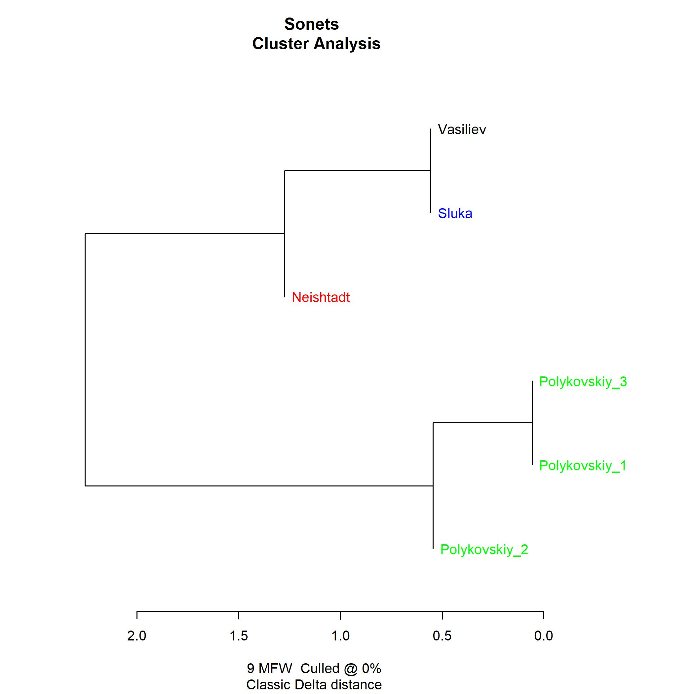

# Стилометрический анализ 6 корон сонетов
Сонеты являются одной из самых распрострененных и сложных жестких форм. Долгое время верхом искусства считалось составление венков сонетов: циклов из 14 сонетов и магистрала, который состоял из последних строчек всех предыдущих сонетов. Затем появились короны сонетов, состоящие из 15 венков сонетов, где 15 венок, или магистральный венок, состоял из предыдущих магистралов. А затем - даже диадемы сонетов, состоящие из 14 корон и 1 короны-магистрала, которая... Кажется, сейчас в мире существует как минимум 6 завершенных диадем сонетов (из которых на русском, скорее всего, нет ни одной, так как о потенциальной завершенности одной утерянной диадемы ведутся споры), но целиком они не опубликованы, в то время как корон достаточно много даже на русском языке. 
Так как уже венок сонетов считается (и авторами, и критиками) крайне жесткой и несвободной формой, возник вопрос, насколько авторская манера и вкус могут проявляться в таких сложных фрактальных произведениях, как короны сонетов, и не будут ли они из-за формальных требований очень похожими друг на друга. 

Для анализа были взяты 6 корон сонетов:
- Марк Полыковский, 1 корона сонетов (примерно 15 тыс. слов), 2010 год (текст взят с сайта "Стихи.ру");
- Марк Полыковский, 2 корона сонетов (примерно 15 тыс. слов), 2010 год (текст взят с сайта "Стихи.ру");
- Марк Полыковский, 3 корона сонетов (примерно 15 тыс. слов), 2010 год (текст взят с сайта "Стихи.ру");
- Владимир Васильев, корона сонетов "Мир" (примерно 18 тыс. слов), 1987 год (текст взят с сайта libfox.ru);
- Александр Слука, "Метаморфозы. Корона венков сонетов" (примерно 12 тыс. слов), 2018 год (текст взят с сайта author.today);
- Евгений Нейштадт, "Роман в сонетах" (примерно 9 тыс. слов), 2014 год (текст взят с сайта e-libra.ru). 

В списке выше указана дата первой публикации, точная дата написания не известна, так как короны могут писаться десятилетиями. 
Задание было выполнено с помощью пакета "Stylo"для R-Studio. 

Результаты показывают, что три короны сонетов Полыковского (заметим при этом, что именно Полыковский и является самым известным в этой выборке) резко отличаются от остальных, которые в общем похожи друг на друга, и даже то, что корона Васильева была опубликована почти на 30 лет раньше, не влияет на близость стиля корон этих трех авторов. Возможно, если бы у Васильева, Слуки или Нейштадта были написаны еще несколько корон, они бы и обособились, а, возможно, именно жесткость формы и обуславливает определенную манеру речи. 
