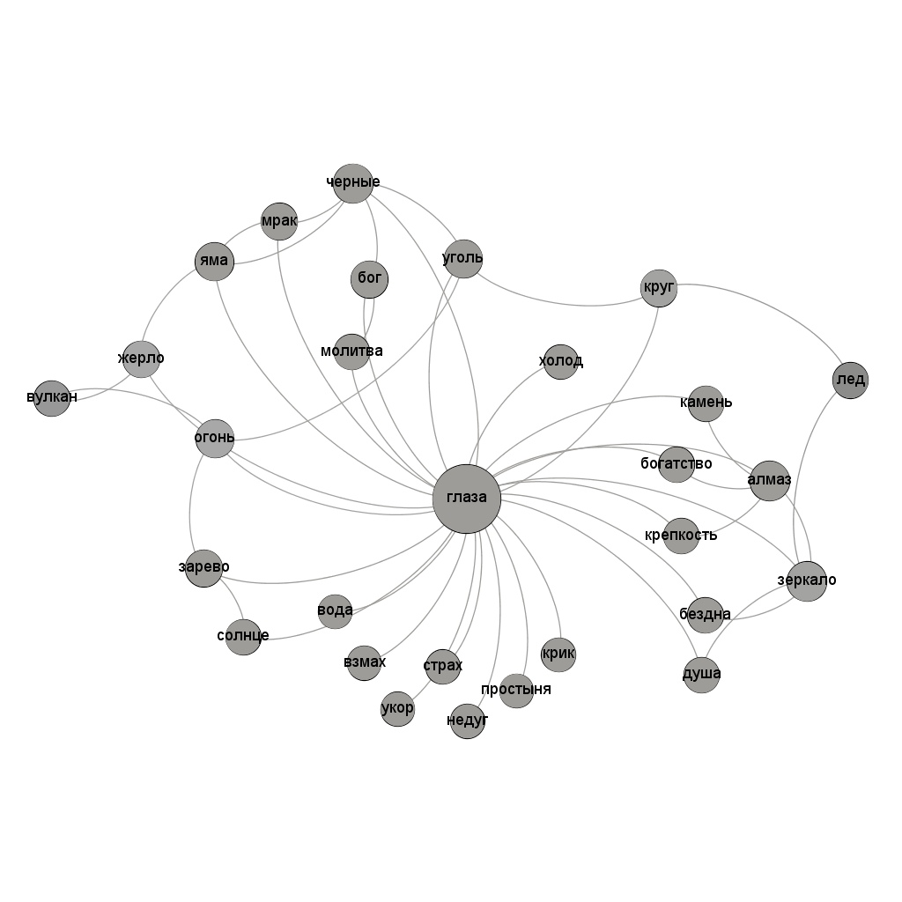

# Анализ стихотворения "Два зарева! — нет, зеркала́!" М. И. Цветаевой (1921 год) с помощью графа

Стихотворение М. И. Цветаевой “Два зарева! − нет, зеркала!..” 1921 года, посвященное М. Кузьмину, обычно прочитывается исследователями, вслед за М. Л. Гаспаровым, писавшим: происходит «нанизывание ассоциаций по сходству, <…> бесконечный поиск выражения для невыразимого», как последовательность казалось бы разрозненных образов, метафор. Каждый следующий образ отрицает предыдущий, будучи отрицаемым последующим, ни один из них не является полной характеристикой. Однако, мне кажется, что эти образы подчинены одной очень простой идее: показать, какие концепты задействованы в реализации когнитивных метафор, связанных с глазами. Я написала об этом отдельную [статью](http://mkmf.net/images/doc/2019_studia%20slavica.pdf), но теперь захотелось проверить, что может добавить к этом анализу построение графа образов. За узлы были взяты отдельные образы (или домены когнитивных метафор), в том числе прилагательное "черные", как крайне важное и многократно повторяющееся, за ребра - смысловая связь с ключевым образом стихотворения, глазами, или другими образами. 

Кроме очевидного вывода о том, что глаза являются наиболее центральным, а значит ключевым образом, можно заметить еще несколько деталей: большая, нежели у остальных узлов, degree наблюдается у узлов "алмаз", "черные", "зеркало", "огонь" и еще нескольких. Это значит, что стихотворение построено не просто как нанизывание подряд не связанных друг с другом образов, а устроено иерархически: образы сначала кластеризуются вокруг какого-то более сложного концепта, и затем уже он сравнивается с глазами (не мешая, конечно, и прямому сравнинию более мелких концептов). Спиралевидное построение текста и постоянное повторение, казалось бы, одинаковых концептов таким образом находит объяснение именно при помощи анализа с использованием графа. 
